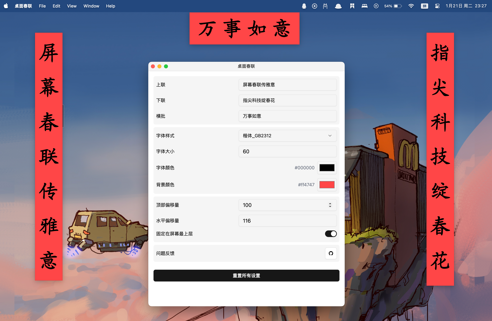

#  Couplet - 桌面春联
>
> 把春节氛围带到你的电脑桌面！

<p align="left">
<a href="https://github.com/liou666/couplet/releases" target="_blank">

</a>
<a href="https://github.com/liou666/couplet/releases" target="_blank">

</a>
<a href="https://github.com/liou666/couplet/releases" target="_blank">

</a>
<a href="https://github.com/liou666/couplet/releases" target="_blank">

</a>
</p>

Couplet 是一款跨平台桌面应用，让传统春联以现代方式展现在你的电脑上 🧨！

<p align="center">
  
</p>

## 📥 下载

| 平台 | 下载链接 |
| :-- | --- |
| **Mac(Apple Silicon)** | [下载](https://github.com/liou666/couplet/releases/download/v0.1.0/couplet_arm64_0.1.0.dmg) |
| **Mac(Inter)** | [下载](https://github.com/liou666/couplet/releases/download/v0.1.0/couplet_x64_0.1.0.dmg) |
| **Windows** | [下载](https://github.com/liou666/couplet/releases/download/v0.1.0/couplet_0.1.0.exe) |
| **Linux** | [下载](https://github.com/liou666/couplet/releases/download/v0.1.0/couplet_0.1.0.AppImage) |

更多版本请访问 **[GitHub Releases](https://github.com/liou666/couplet/releases)**

## ✨ 特性

- 😊 桌面实时展示春联：让你的桌面年味十足！
- 🎨 自定义字体和样式：随心搭配，个性化设置。
- 🚀 跨平台支持（Windows、macOS、Linux）
- 🌙 深色模式适配
- 🌍 多语言支持（开发中）

## 🛠️ 开发

```bash
# 1. 克隆该仓库;
git clone https://github.com/liou666/couplet.git

# 2. 安装依赖;
cd couplet
pnpm install

# 如果 Electron 安装失败，可以尝试使用淘宝镜像源👇:
# export ELECTRON_MIRROR=http://npm.taobao.org/mirrors/electron/ && pnpm i

# 3. 启动服务
pnpm dev
```

## 💭 常见问题

<details>
<summary>1. MacOS 提示"无法打开'桌面春联'，因为 Apple 无法检查其是否包含恶意软件"，"'桌面春联'已损坏" </summary>

> 提示：这些安全提示是 MacOS 的正常保护机制，主要是因为应用未经过 Apple 认证签名导致。按照以下步骤操作后即可正常使用。

1. 通过终端执行：

```bash
xattr -rd com.apple.quarantine /Applications/桌 面 春 联 .app
```

2. 在"系统偏好设置 > 安全性与隐私"中允许应用运行

</details>

## 📄 License

[MIT](./LICENSE)
